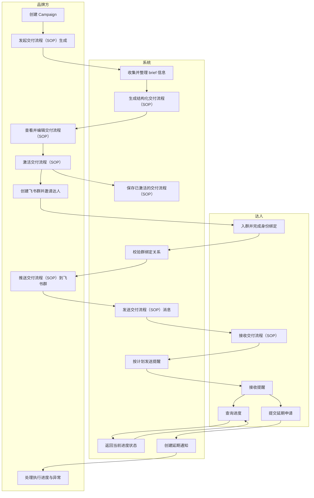

# 交付流程（SOP）管理

`交付流程（SOP）管理` 是指：把品牌 brief 转化为可执行的交付流程（SOP），并将交付流程（SOP）传递到达人协作场景中，再通过自动提醒、进度查询和延期反馈完成后续跟进。

## 解决的问题

- 需求通过聊天零散传达，达人容易遗漏关键信息
- 截止时间依赖人工催促，运营跟进成本高
- 项目进度不透明，品牌方和达人都难以及时掌握状态
- 延期等异常情况缺少统一反馈入口

## 业务价值

1. **业务目标与价值**
   - 将品牌 brief 快速转化为可执行交付流程（SOP），降低人工编写与反复跟进成本，提升达人协作效率、按时交付率和流程可控性。
2. **业务参与者与组织**
   - 品牌方负责发起、确认和推动交付流程（SOP）执行；
   - 达人负责接收交付流程（SOP）、跟进节点并反馈异常；
   - 系统负责生成交付流程（SOP）、推送消息、发送提醒和沉淀状态。
3. **业务流程与场景**
   - 品牌方生成并确认交付流程（SOP），达人完成群组绑定后接收交付流程（SOP），系统按关键时间节点自动提醒，达人可查询进度或申请延期，品牌方据此持续推进合作执行。
4. **业务规则与约束**
   - 交付流程（SOP）需先生成并激活后才能推送；达人需先完成绑定后才能接收协作消息；提醒按预设时间节点自动触发；延期申请进入人工处理，不在 MVP 内自动审批。
5. **业务对象与数据**
   - 核心对象包括 campaign、brief、交付流程（SOP）、交付流程（SOP）步骤、达人绑定关系、提醒记录和延期申请，这些数据共同支撑流程生成、消息触达、状态跟踪与异常处理。
6. **业务事件与时机**
   - 关键业务事件包括发起交付流程（SOP）生成、激活交付流程（SOP）、达人绑定、推送交付流程（SOP）、节点到期前提醒、达人查询进度和提交延期申请；每个事件都对应明确的触发时机与后续动作。

**一句话版本**

- `交付流程（SOP）管理` 的业务价值在于：把品牌需求转化为标准化执行流程，并通过自动推送、提醒和反馈机制，让达人合作从“人工催进度”升级为“系统驱动协同”。

## 核心能力

- 基于 campaign brief 自动生成交付流程（SOP）
- 品牌侧编辑、重新生成和激活交付流程（SOP）
- 将交付流程（SOP）推送到已绑定的飞书群
- 在关键节点前自动发送提醒
- 支持达人查询当前进度
- 支持达人提交延期申请

## 如何使用

### 品牌方

- 在 campaign 中生成交付流程（SOP）
- 填写目标市场、达人类型、卖点、发布日期等关键信息
- 查看并调整系统生成的交付流程（SOP）
- 激活交付流程（SOP），并推送到已绑定的飞书群

### 达人

- 加入飞书群并完成身份绑定
- 在群内接收交付流程（SOP）和提醒消息
- 查询当前阶段和剩余时间
- 在需要时提交延期申请

## 业务价值

- 缩短交付流程（SOP）生成时间
- 降低人工跟进成本
- 提升达人按时提交率
- 让执行流程更清晰、更稳定、更可追踪

## MVP 范围

MVP 已包含：

- 交付流程（SOP）生成
- 交付流程（SOP）编辑与激活
- 飞书群绑定
- 交付流程（SOP）推送
- 自动提醒
- 进度查询
- 延期反馈

MVP 暂不包含：

- 完整内容审批流
- 交付流程（SOP）模板库管理
- 更复杂的机器人卡片交互
- 自定义提醒策略
- 高级导出能力

## 业务泳道图

## 总结

`交付流程（SOP）管理` 帮助品牌方把 brief 更快转化为结构化执行方案，也帮助达人通过飞书消息和自动提醒更顺畅地推进合作流程。

它是 MVP 业务闭环中的关键一环，因为它连接了 campaign 配置与实际执行。
